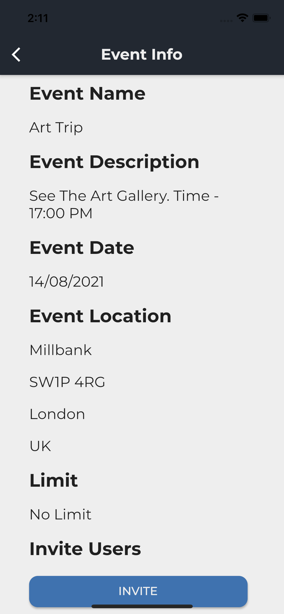

# Event Planner

Discover brand new places to invite your friends and family, schedule events at these locations and enjoy yourself at these events.

## Description

Welcome to Event Planner, an Android/iOS app created using Flutter where you can discover places to go, create/schedule events and manage events you are invited to. Struggling to find places to go? Discover a wide range of places such as restaurants, bars, activities and many more. Once you found a place to go, why not invite your friends? Event Planner allows you to easily create events, using places on the app or enter your own details, invite other users and also keep track of your invited events. See all events you are hosting, invited to and information about each event. The search functionality allows you to discover new places easily and gives you easy access to information about each place. Start discovering places today!

## Screenshots

## Getting Started

### Dependencies

- Android

### Installing App

- [Install App From Google Playstore](https://play.google.com/store/apps/details?id=com.app.event_planner)

## Key Features

- Discover Places To Go
  - Find Top Rated Locations All In One Place
  - View Key Information About The Place (Name, Location & Website)
- Create Events
  - Once You Found A Place, Create An Event And Invite Your Friends & Family
  - Set A Limit On The Event
- Manage Events
  - See All Events You Are Hosting
  - See All Events You Are Invited To

## Help

If you experience any issues or common problems, feel free to create a new issue.

## Author(s)

Azhar Moosa

## Version History

- 0.1
  - Initial Release

## License

This project is licensed under the MIT License - see the LICENSE.md file for details

## Acknowledgments

Information About Places

- [Google Places API](https://developers.google.com/maps/documentation/places/web-service/overview)
